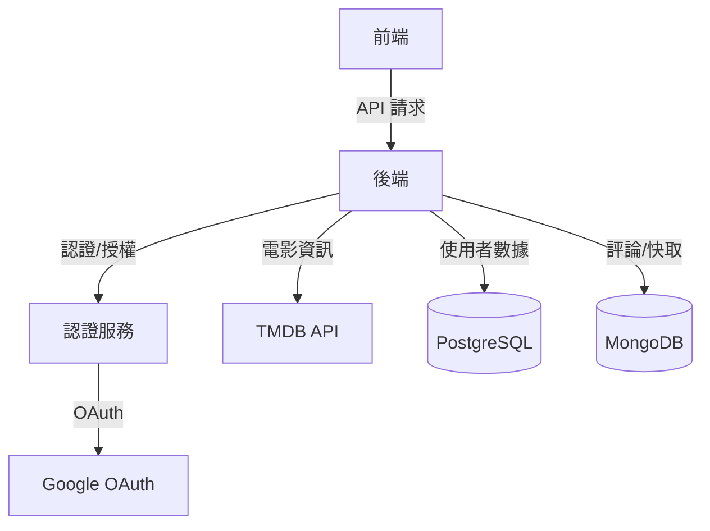
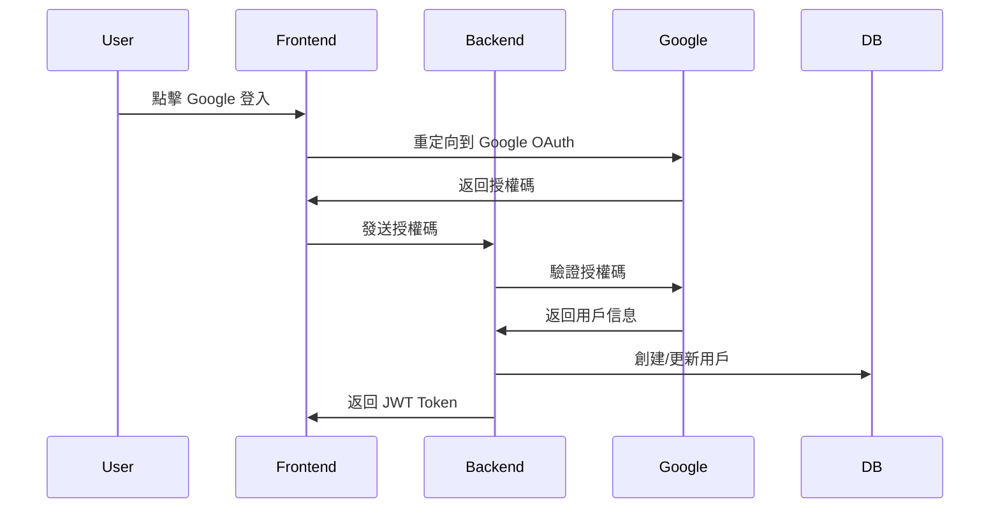
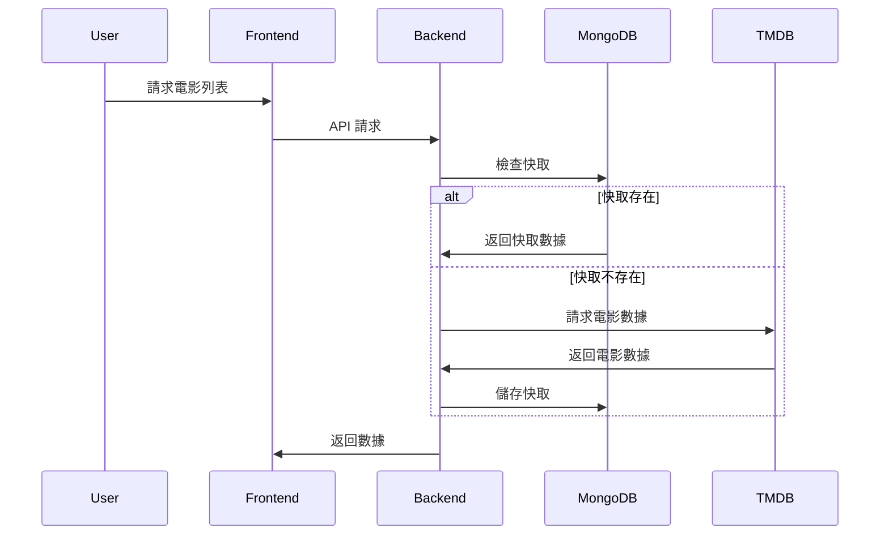

# 系統架構設計

## 整體架構



## 核心功能流程

### 1. 使用者認證流程



### 2. 電影資訊流程



## 資料庫設計

### PostgreSQL 核心結構

```sql
-- 用戶表 (核心欄位)
CREATE TABLE users (
    id SERIAL PRIMARY KEY,
    email VARCHAR(255) UNIQUE NOT NULL,
    name VARCHAR(255) NOT NULL,
    password VARCHAR(255) NOT NULL,
    google_id VARCHAR(255) UNIQUE,
    created_at TIMESTAMP DEFAULT CURRENT_TIMESTAMP,
    updated_at TIMESTAMP DEFAULT CURRENT_TIMESTAMP,
    CONSTRAINT email_format CHECK (email ~* '^[A-Za-z0-9._%+-]+@[A-Za-z0-9.-]+\.[A-Za-z]{2,}$')
);

-- 收藏表
CREATE TABLE favorites (
    id SERIAL PRIMARY KEY,
    user_id INTEGER REFERENCES users(id) ON DELETE CASCADE,
    movie_id INTEGER NOT NULL,
    created_at TIMESTAMP DEFAULT CURRENT_TIMESTAMP,
    UNIQUE(user_id, movie_id)
);

-- 評分表
CREATE TABLE ratings (
    id SERIAL PRIMARY KEY,
    user_id INTEGER REFERENCES users(id) ON DELETE CASCADE,
    movie_id INTEGER NOT NULL,
    score INTEGER CHECK (score >= 1 AND score <= 5),
    created_at TIMESTAMP DEFAULT CURRENT_TIMESTAMP,
    updated_at TIMESTAMP DEFAULT CURRENT_TIMESTAMP,
    UNIQUE(user_id, movie_id)
);
```

### 說明

1. User 表核心欄位：
   - id: 用戶唯一標識
   - email: 唯一電子郵件（加入格式驗證）
   - name: 用戶名稱
   - password: 密碼
   - google_id: Google 登入 ID（可選）
   - created_at/updated_at: 時間戳記

2. Rating 表：
   - score: 1-5 分評分限制
   - movie_id: 電影 ID
   - 用戶關聯: ON DELETE CASCADE
   - 唯一約束: 每部電影每個用戶只能評分一次

3. Favorite 表：
   - movie_id: 電影 ID
   - 用戶關聯: ON DELETE CASCADE
   - 唯一約束: 防止重複收藏

### MongoDB 文件結構

```javascript
// 電影快取
{
  _id: ObjectId,
  tmdb_id: Number,
  title: String,
  overview: String,
  poster_path: String,
  release_date: Date,
  cached_at: Date,
  expire_at: Date
}
```

## 核心技術選擇說明

1. 後端技術
   - Express.js: 輕量級框架
   - TypeScript: 型別安全
   - Prisma: 強型別 ORM
   - Mongoose: MongoDB ODM

2. 資料庫選擇
   - PostgreSQL: 用戶資料、評分和收藏（需要關聯和一致性）
   - MongoDB: 電影資訊快取（適合文件結構）

3. 安全性考慮
   - JWT + OAuth: 身份驗證
   - 密碼加密存儲
   - 資料驗證

4. 效能優化
   - MongoDB 快取機制
   - 資料庫索引優化