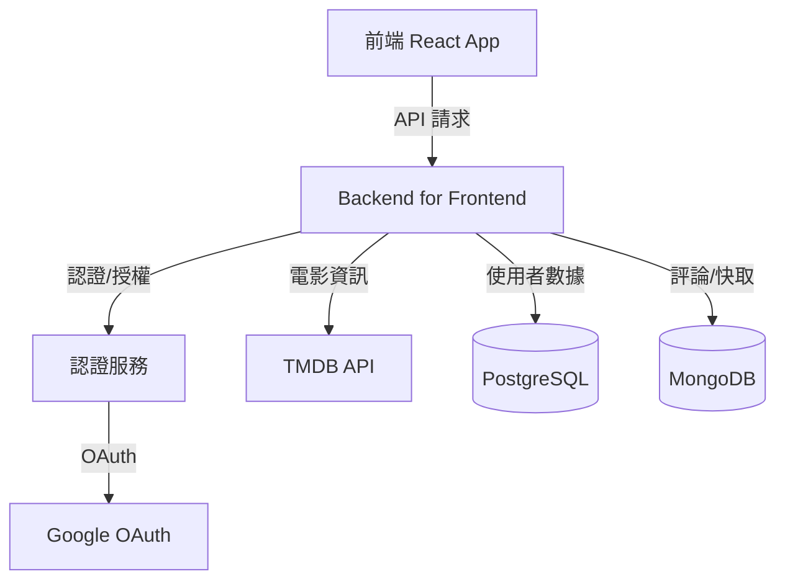
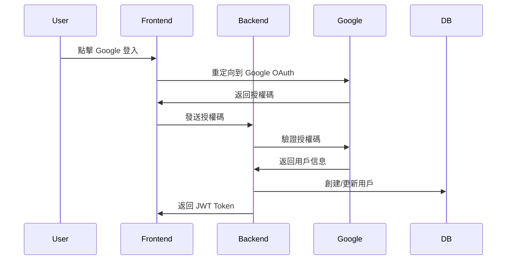
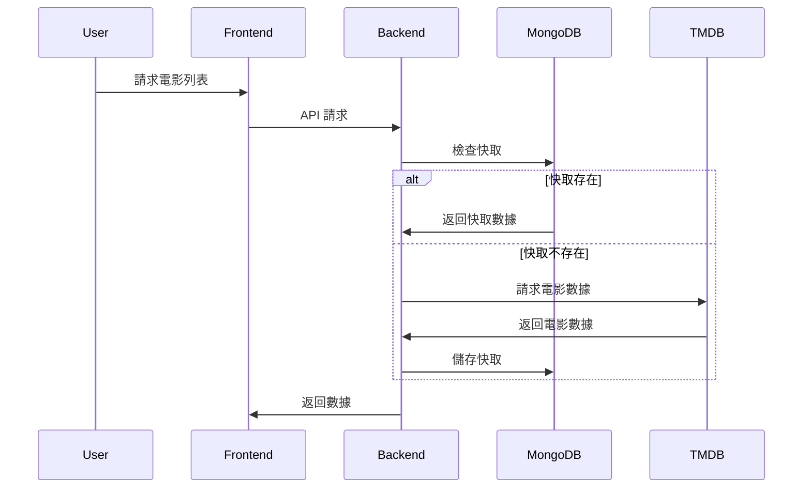

# 系統架構設計

## 整體架構



## 核心功能流程

### 1. 使用者認證流程



### 2. 電影資訊流程



## 資料庫設計

### PostgreSQL 架構

```sql
-- 用戶表
CREATE TABLE users (
    id SERIAL PRIMARY KEY,
    email VARCHAR(255) UNIQUE NOT NULL,
    name VARCHAR(255) NOT NULL,
    google_id VARCHAR(255) UNIQUE,
    created_at TIMESTAMP DEFAULT CURRENT_TIMESTAMP
);

-- 收藏表
CREATE TABLE favorites (
    id SERIAL PRIMARY KEY,
    user_id INTEGER REFERENCES users(id),
    movie_id INTEGER NOT NULL,
    created_at TIMESTAMP DEFAULT CURRENT_TIMESTAMP,
    UNIQUE(user_id, movie_id)
);

-- 評分表
CREATE TABLE ratings (
    id SERIAL PRIMARY KEY,
    user_id INTEGER REFERENCES users(id),
    movie_id INTEGER NOT NULL,
    score INTEGER CHECK (score >= 1 AND score <= 5),
    created_at TIMESTAMP DEFAULT CURRENT_TIMESTAMP,
    UNIQUE(user_id, movie_id)
);
```

### MongoDB 文件結構

```javascript
// 電影快取
{
  _id: ObjectId,
  tmdb_id: Number,
  title: String,
  overview: String,
  poster_path: String,
  release_date: Date,
  cached_at: Date,
  expire_at: Date
}

// 評論
{
  _id: ObjectId,
  user_id: Number,
  movie_id: Number,
  content: String,
  created_at: Date,
  updated_at: Date
}
```

## 技術選擇說明

1. 前端技術
   - React.js：組件化開發，豐富的生態系統
   - TypeScript：型別安全，更好的開發體驗
   - Material UI：快速構建一致的 UI 介面

2. 後端技術
   - Express.js：輕量級、靈活的 Node.js 框架
   - TypeScript：共用前端的型別定義
   - Prisma：類型安全的 ORM，自動生成類型
   - Mongoose：靈活的 MongoDB ODM

3. 資料庫選擇
   - PostgreSQL：
     - 用戶數據：強一致性需求
     - 收藏/評分：需要關聯查詢
   - MongoDB：
     - 電影快取：文件結構適合存儲 TMDB 數據
     - 評論數據：靈活的 schema

4. 安全性考慮
   - JWT + OAuth：安全的身份驗證
   - Helmet：HTTP 安全標頭
   - Rate Limiting：防止濫用
   - 資料驗證：使用 Joi 驗證所有輸入

5. 效能優化
   - MongoDB 快取：減少 TMDB API 調用
   - 資料庫索引：優化查詢性能
   - API 響應壓縮：減少傳輸大小