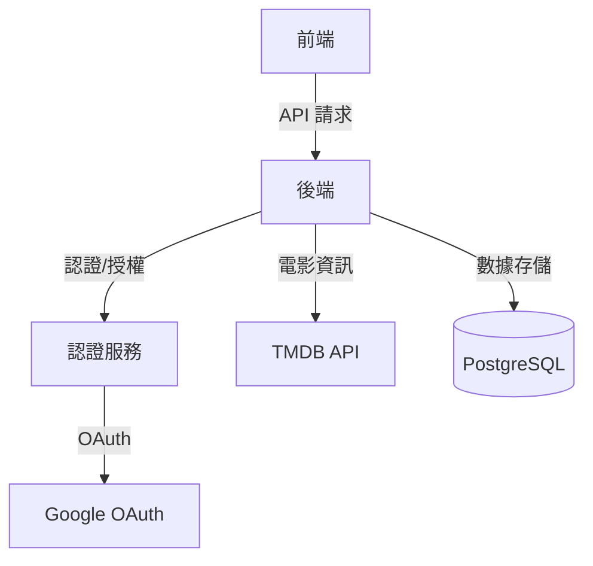
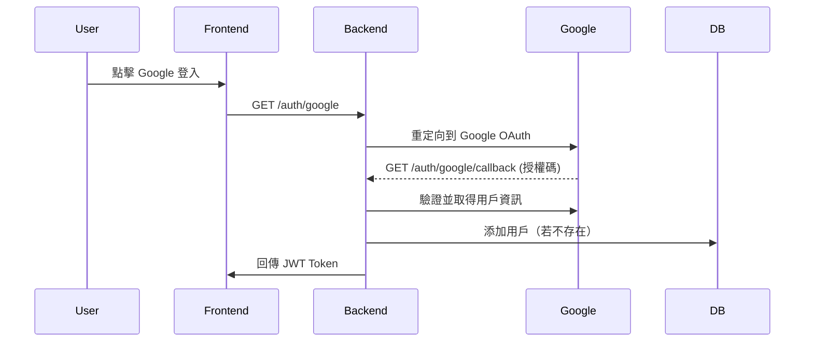
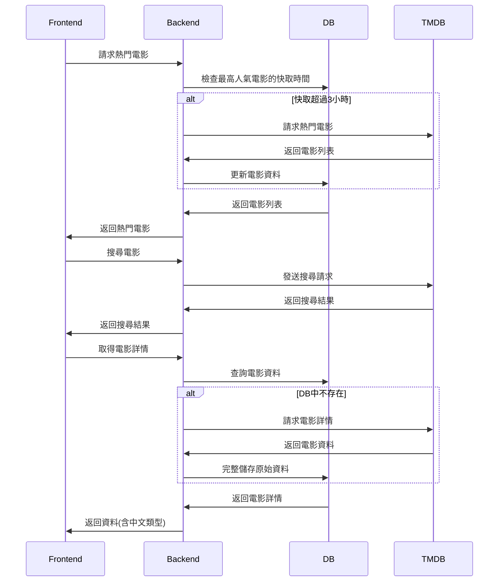
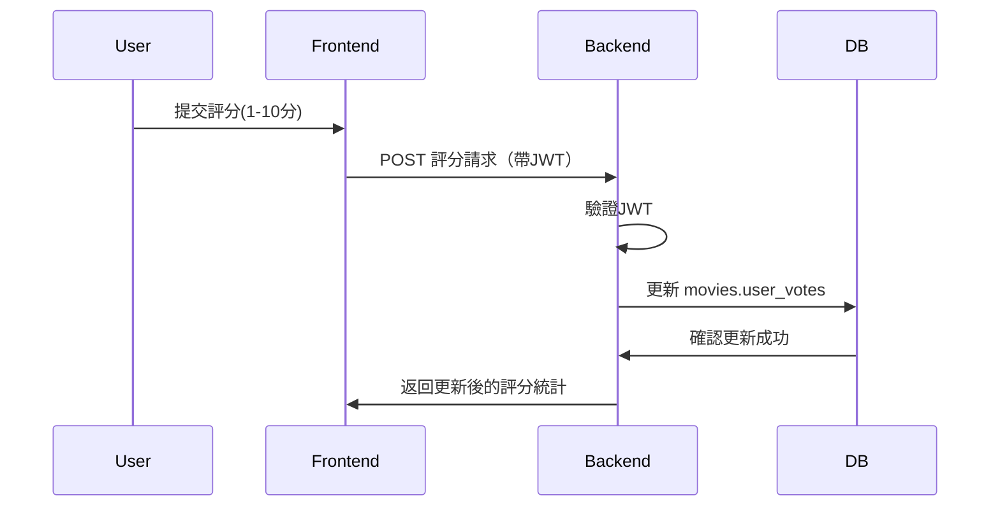

# 系統架構設計

## 整體架構



## 資料庫架構設計

### PostgreSQL 架構

#### 1. Users 表
用戶基本資料和認證資訊
```sql
CREATE TABLE users (
    id          SERIAL PRIMARY KEY,
    email       VARCHAR(255) UNIQUE NOT NULL,
    name        VARCHAR(255) NOT NULL,
    google_id   VARCHAR(255) UNIQUE,
    created_at  TIMESTAMP DEFAULT CURRENT_TIMESTAMP,
    updated_at  TIMESTAMP DEFAULT CURRENT_TIMESTAMP
);
```

#### 2. Movies 表
電影資訊與評分數據（對齊 TMDB API）
```sql
CREATE TABLE movies (
    -- 基本資訊
    id              INTEGER PRIMARY KEY,  -- TMDB movie_id
    title           VARCHAR(255) NOT NULL,
    original_title  VARCHAR(255),
    original_language VARCHAR(50),
    overview        TEXT,
    tagline         TEXT,
    
    -- 視覺元素
    poster_path     VARCHAR(255),
    backdrop_path   VARCHAR(255),
    
    -- 時間和分類資訊
    release_date    DATE,
    runtime         INTEGER,
    genre_ids       INTEGER[],
    
    -- 統計數據
    popularity      FLOAT,
    vote_average    FLOAT,
    vote_count      INTEGER,
    
    -- 其他資訊
    adult           BOOLEAN DEFAULT false,
    video           BOOLEAN DEFAULT false,
    
    -- 製作資訊
    budget          BIGINT,
    revenue         BIGINT,
    homepage        VARCHAR(255),
    imdb_id         VARCHAR(20),
    status          VARCHAR(50),
    
    -- 複雜資料結構（JSON 格式儲存）
    belongs_to_collection JSONB,
    production_companies JSONB,
    production_countries JSONB,
    spoken_languages    JSONB,
    origin_country      VARCHAR(10)[],
    
    -- 本地評分資料
    user_votes      JSONB DEFAULT '{}',  -- 格式：{ "userId": score }
    
    -- 快取時間
    cached_at       TIMESTAMP DEFAULT CURRENT_TIMESTAMP
);

-- 索引優化
CREATE INDEX idx_movies_release_date ON movies(release_date);
CREATE INDEX idx_movies_popularity ON movies(popularity);
CREATE INDEX idx_movies_title ON movies(title);
```

### 資料設計說明

1. 電影資訊存儲
   * 完整保存 TMDB API 回傳的所有欄位
   * 複雜資料結構使用 JSONB 類型儲存
   * 確保資料完整性和未來擴展性

2. 電影評分機制
   * 評分儲存：使用 JSONB 類型的 user_votes 欄位儲存用戶評分
   * 格式：`{ "userId": score }`，score 為 1-10 的整數
   * 優點：
     - 簡化資料結構，無需額外的評分表
     - 一次操作即可完成評分更新
     - 容易擴展（可添加時間戳等額外資訊）

3. 效能考慮
   * 使用 JSONB 類型支援索引和高效查詢
   * 評分更新為原子操作，減少資料庫負擔
   * 適合讀多寫少的評分場景

## 核心功能流程

### 1. 使用者認證流程



### 2. 核心功能流程



### 3. 用戶評分流程



## 技術選擇說明

1. 前端技術
   - React.js：組件化開發，豐富的生態系統
   - TypeScript：型別安全，更好的開發體驗
   - Material UI：快速構建一致的 UI 介面

2. 後端技術
   - Express.js：輕量級、靈活的 Node.js 框架
   - TypeScript：共用前端的型別定義
   - Prisma：類型安全的 ORM，自動生成類型

3. 環境配置架構
   - 雙環境設計：
     * Development：整合開發和測試環境，提供完整的開發功能
     * Production：專注於效能和穩定性的生產環境
   - 環境變數管理：
     * dotenv-cli：動態載入環境設定
     * 分離的配置檔案：.env.development 和 .env.production
   - 環境特性：
     * Development：
       - 詳細的日誌輸出
       - 支援測試和開發工具
       - 熱重載功能
     * Production：
       - 最小化日誌輸出
       - 效能優化設定
       - 強化的安全措施

4. 資料庫選擇
   - PostgreSQL：
     * 用戶數據：強一致性需求
     * 電影資訊快取：完整保存 TMDB API 資料
     * JSONB 支援：高效能的複雜資料儲存

5. 安全性考慮
   - JWT + OAuth：安全的身份驗證
   - Helmet：HTTP 安全標頭
   - Rate Limiting：防止濫用
   - 資料驗證：使用 Joi 驗證所有輸入

6. 效能優化
   - 資料庫索引：
     * movies 表：release_date、popularity、title 索引
   - 本地快取策略：
     * Popular API：檢查最高人氣電影的快取時間，若超過 3 小時則向 TMDB 取得最新資料
     * Movie Details API：僅在資料庫無該電影時調用 TMDB API
   - 錯誤處理完善：明確的錯誤代碼和提示訊息