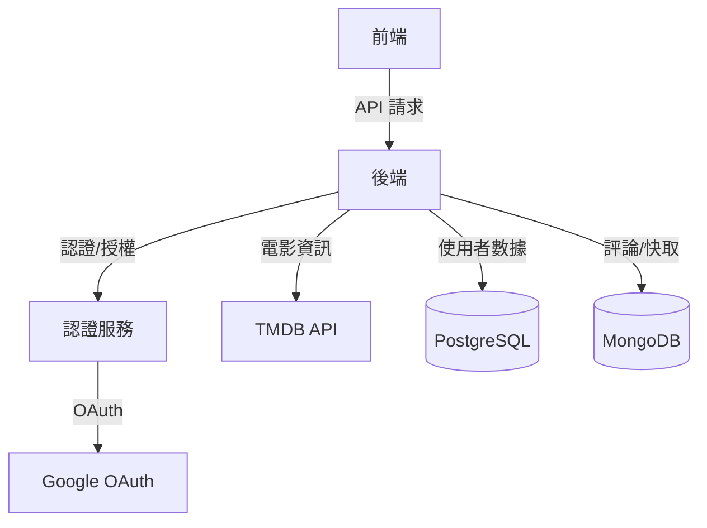
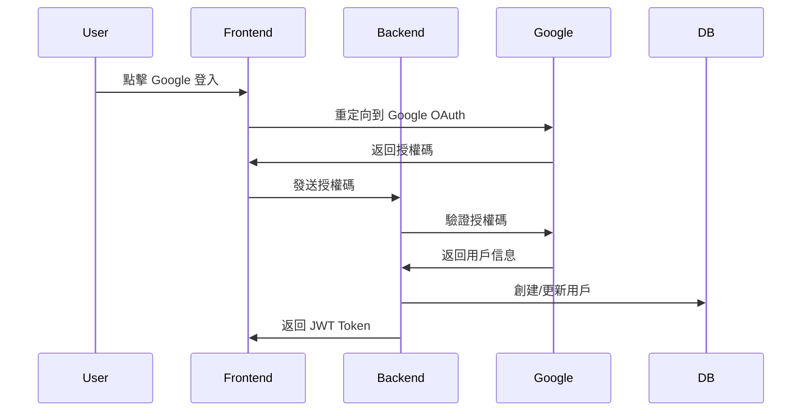
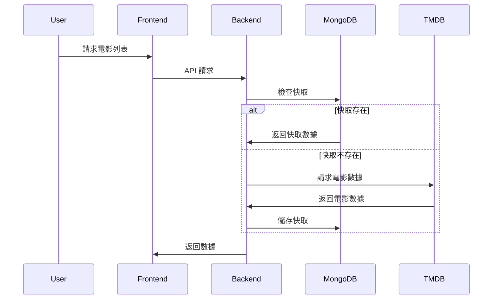

# 系統架構設計

## 整體架構



## 資料庫架構設計

### 一、PostgreSQL 架構

#### 1. Users 表
用戶基本資料和認證資訊
```sql
CREATE TABLE users (
    id          SERIAL PRIMARY KEY,
    email       VARCHAR(255) UNIQUE NOT NULL,
    password    VARCHAR(255) NOT NULL,
    name        VARCHAR(255) NOT NULL,
    google_id   VARCHAR(255) UNIQUE,
    created_at  TIMESTAMP DEFAULT CURRENT_TIMESTAMP,
    updated_at  TIMESTAMP DEFAULT CURRENT_TIMESTAMP
);

CREATE INDEX idx_users_email ON users(email);
CREATE INDEX idx_users_google_id ON users(google_id);
```

#### 2. Ratings 表
用戶對電影的評分記錄
```sql
CREATE TABLE ratings (
    id          SERIAL PRIMARY KEY,
    user_id     INTEGER REFERENCES users(id) ON DELETE CASCADE,
    movie_id    INTEGER NOT NULL,
    score       SMALLINT NOT NULL,
    CONSTRAINT rating_score_range CHECK (score >= 1 AND score <= 5),
    created_at  TIMESTAMP DEFAULT CURRENT_TIMESTAMP,
    updated_at  TIMESTAMP DEFAULT CURRENT_TIMESTAMP,
    UNIQUE(user_id, movie_id)
);

CREATE INDEX idx_ratings_user_movie ON ratings(user_id, movie_id);
```

#### 3. Favorites 表
用戶的電影收藏清單
```sql
CREATE TABLE favorites (
    id          SERIAL PRIMARY KEY,
    user_id     INTEGER REFERENCES users(id) ON DELETE CASCADE,
    movie_id    INTEGER NOT NULL,
    created_at  TIMESTAMP DEFAULT CURRENT_TIMESTAMP,
    UNIQUE(user_id, movie_id)
);

CREATE INDEX idx_favorites_user_movie ON favorites(user_id, movie_id);
```

### 二、MongoDB 架構

#### 1. movies 集合
快取的電影資訊
```javascript
{
  _id: ObjectId,
  tmdb_id: Number,           // TMDB API 的電影 ID
  title: String,             // 電影標題
  overview: String,          // 電影簡介
  poster_path: String,       // 海報路徑
  release_date: Date,        // 上映日期
  cached_at: Date,          // 快取時間
  expire_at: Date           // 快取過期時間
}

// 索引
db.movies.createIndex({ "tmdb_id": 1 }, { unique: true });
db.movies.createIndex({ "expire_at": 1 }, { expireAfterSeconds: 0 });
```

#### 2. comments 集合
用戶評論
```javascript
{
  _id: ObjectId,
  user_id: Number,          // 關聯到 PostgreSQL users 表
  movie_id: Number,         // TMDB 電影 ID
  content: String,          // 評論內容
  created_at: Date,
  updated_at: Date
}

// 索引
db.comments.createIndex({ "user_id": 1, "movie_id": 1 });
db.comments.createIndex({ "movie_id": 1, "created_at": -1 });
```

### 三、資料關係設計

1. User - Rating 關係
   - 一對多關係
   - CASCADE DELETE
   - 唯一約束確保一個用戶只能對一部電影評分一次

2. User - Favorite 關係
   - 一對多關係
   - CASCADE DELETE
   - 唯一約束確保不重複收藏

3. User - Comment 關係
   - 一對多關係
   - 使用 user_id 作為外鍵關聯
   - MongoDB 中通過索引優化查詢

## 核心功能流程

### 1. 使用者認證流程



### 2. 電影資訊流程



## 技術選擇說明

1. 前端技術
   - React.js：組件化開發，豐富的生態系統
   - TypeScript：型別安全，更好的開發體驗
   - Material UI：快速構建一致的 UI 介面

2. 後端技術
   - Express.js：輕量級、靈活的 Node.js 框架
   - TypeScript：共用前端的型別定義
   - Prisma：類型安全的 ORM，自動生成類型
   - Mongoose：靈活的 MongoDB ODM

3. 資料庫選擇
   - PostgreSQL：
     - 用戶數據：強一致性需求
     - 收藏/評分：需要關聯查詢
   - MongoDB：
     - 電影快取：文件結構適合存儲 TMDB 數據
     - 評論數據：靈活的 schema

4. 安全性考慮
   - JWT + OAuth：安全的身份驗證
   - Helmet：HTTP 安全標頭
   - Rate Limiting：防止濫用
   - 資料驗證：使用 Joi 驗證所有輸入

5. 效能優化
   - MongoDB 快取：減少 TMDB API 調用
   - 資料庫索引：優化查詢性能
   - API 響應壓縮：減少傳輸大小