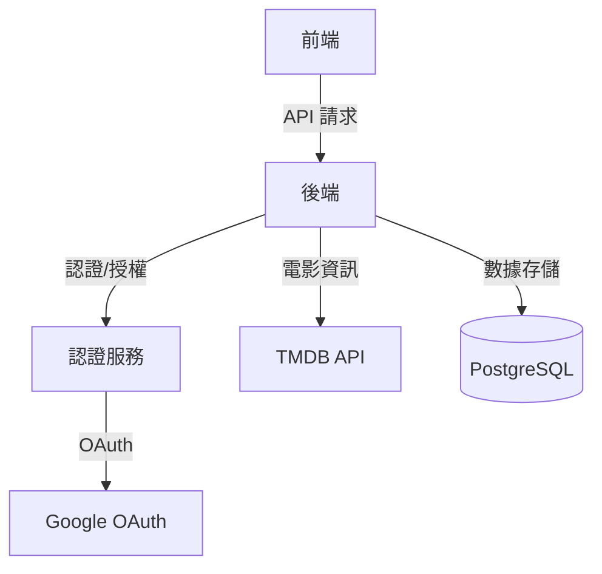
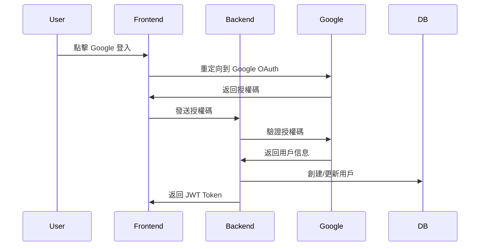
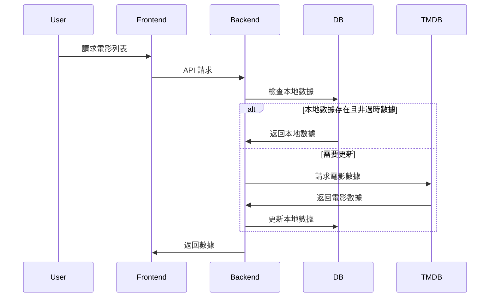
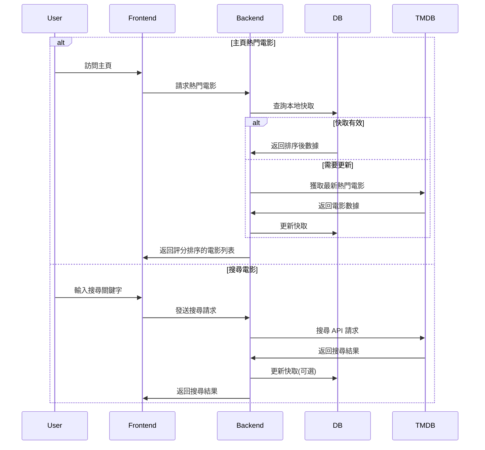

# 系統架構設計

## 整體架構



## 資料庫架構設計

### PostgreSQL 架構

#### 1. Users 表
用戶基本資料和認證資訊
```sql
CREATE TABLE users (
    id          SERIAL PRIMARY KEY,
    email       VARCHAR(255) UNIQUE NOT NULL,
    password    VARCHAR(255),
    name        VARCHAR(255) NOT NULL,
    google_id   VARCHAR(255) UNIQUE,
    created_at  TIMESTAMP DEFAULT CURRENT_TIMESTAMP,
    updated_at  TIMESTAMP DEFAULT CURRENT_TIMESTAMP
);
```

#### 2. Movies 表
電影基本資訊快取
```sql
CREATE TABLE movies (
    id              INTEGER PRIMARY KEY,  -- TMDB movie_id
    title           VARCHAR(255) NOT NULL,
    overview        TEXT,
    poster_path     VARCHAR(255),
    release_date    DATE,
    popularity      FLOAT,
    vote_average    FLOAT,
    vote_count      INTEGER,
    cached_at       TIMESTAMP DEFAULT CURRENT_TIMESTAMP
);

CREATE INDEX idx_movies_release_date ON movies(release_date);
CREATE INDEX idx_movies_popularity ON movies(popularity);
CREATE INDEX idx_movies_vote_average ON movies(vote_average);
```

#### 3. Ratings 表
用戶對電影的評分
```sql
CREATE TABLE ratings (
    id          SERIAL PRIMARY KEY,
    user_id     INTEGER REFERENCES users(id) ON DELETE CASCADE,
    movie_id    INTEGER NOT NULL,
    score       SMALLINT NOT NULL,
    created_at  TIMESTAMP DEFAULT CURRENT_TIMESTAMP,
    CONSTRAINT rating_score_range CHECK (score >= 1 AND score <= 5),
    UNIQUE(user_id, movie_id)
);

CREATE INDEX idx_ratings_user_movie ON ratings(user_id, movie_id);
CREATE INDEX idx_ratings_movie_score ON ratings(movie_id, score);
```

#### 4. Reviews 表
用戶對電影的評論
```sql
CREATE TABLE reviews (
    id          SERIAL PRIMARY KEY,
    user_id     INTEGER REFERENCES users(id) ON DELETE CASCADE,
    movie_id    INTEGER NOT NULL,
    content     TEXT NOT NULL,
    created_at  TIMESTAMP DEFAULT CURRENT_TIMESTAMP,
    updated_at  TIMESTAMP DEFAULT CURRENT_TIMESTAMP,
    UNIQUE(user_id, movie_id)
);

CREATE INDEX idx_reviews_user_movie ON reviews(user_id, movie_id);
CREATE INDEX idx_reviews_movie_created ON reviews(movie_id, created_at);
```

#### 5. Favorites 表
用戶的電影收藏清單
```sql
CREATE TABLE favorites (
    id          SERIAL PRIMARY KEY,
    user_id     INTEGER REFERENCES users(id) ON DELETE CASCADE,
    movie_id    INTEGER NOT NULL,
    created_at  TIMESTAMP DEFAULT CURRENT_TIMESTAMP,
    UNIQUE(user_id, movie_id)
);

CREATE INDEX idx_favorites_user_movie ON favorites(user_id, movie_id);
```

### 資料關係設計

1. User - Rating 關係
   - 一對多關係
   - CASCADE DELETE
   - 唯一約束確保一個用戶只能對一部電影評分一次

2. User - Review 關係
   - 一對多關係
   - CASCADE DELETE
   - 唯一約束確保一個用戶只能對一部電影發表一個評論

3. User - Favorite 關係
   - 一對多關係
   - CASCADE DELETE
   - 唯一約束確保不重複收藏

## 核心功能流程

### 1. 使用者認證流程



### 2. 電影資訊流程



### 3. 電影瀏覽流程



## 技術選擇說明

1. 前端技術
   - React.js：組件化開發，豐富的生態系統
   - TypeScript：型別安全，更好的開發體驗
   - Material UI：快速構建一致的 UI 介面

2. 後端技術
   - Express.js：輕量級、靈活的 Node.js 框架
   - TypeScript：共用前端的型別定義
   - Prisma：類型安全的 ORM，自動生成類型

3. 資料庫選擇
   - PostgreSQL：
     - 用戶數據：強一致性需求
     - 評分和評論：關聯式查詢
     - 電影資訊快取：減少 API 調用

4. 安全性考慮
   - JWT + OAuth：安全的身份驗證
   - Helmet：HTTP 安全標頭
   - Rate Limiting：防止濫用
   - 資料驗證：使用 Joi 驗證所有輸入

5. 效能優化
   - 資料庫索引：
     - movies 表：release_date、popularity、vote_average 索引
     - ratings 表：user_movie、movie_score 複合索引
     - reviews 表：user_movie、movie_created 複合索引
   - 本地快取：減少 TMDB API 調用
     - 熱門電影快取：定期更新
     - 搜尋結果快取：減少重複請求
   - API 響應壓縮：減少傳輸大小