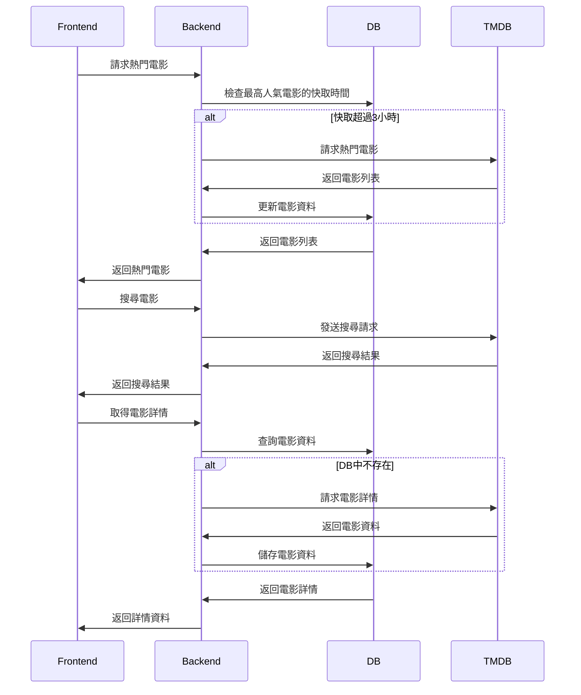

# 系統架構設計

## 整體架構


## 資料庫架構設計

### PostgreSQL 架構

#### 1. Users 表
用戶基本資料和認證資訊
```sql
CREATE TABLE users (
    id          SERIAL PRIMARY KEY,
    email       VARCHAR(255) UNIQUE NOT NULL,
    name        VARCHAR(255) NOT NULL,
    google_id   VARCHAR(255) UNIQUE,
    created_at  TIMESTAMP DEFAULT CURRENT_TIMESTAMP,
    updated_at  TIMESTAMP DEFAULT CURRENT_TIMESTAMP
);
```

#### 2. Movies 表
電影基本資訊快取
```sql
CREATE TABLE movies (
    id              INTEGER PRIMARY KEY,  -- TMDB movie_id
    title           VARCHAR(255) NOT NULL,
    overview        TEXT,
    poster_path     VARCHAR(255),
    release_date    DATE,
    popularity      FLOAT,
    vote_average    FLOAT,
    vote_count      INTEGER,
    cached_at       TIMESTAMP DEFAULT CURRENT_TIMESTAMP
);

CREATE INDEX idx_movies_release_date ON movies(release_date);
CREATE INDEX idx_movies_popularity ON movies(popularity);
```

#### 3. Ratings 表
用戶對電影的評分
```sql
CREATE TABLE ratings (
    id          SERIAL PRIMARY KEY,
    user_id     INTEGER REFERENCES users(id) ON DELETE CASCADE,
    movie_id    INTEGER NOT NULL,
    score       SMALLINT NOT NULL,
    created_at  TIMESTAMP DEFAULT CURRENT_TIMESTAMP,
    CONSTRAINT rating_score_range CHECK (score >= 1 AND score <= 10),
    UNIQUE(user_id, movie_id)
);

CREATE INDEX idx_ratings_user_movie ON ratings(user_id, movie_id);
CREATE INDEX idx_ratings_movie_score ON ratings(movie_id, score);
```

### 資料關係設計

1. User - Rating 關係
   - 一對多關係
   - CASCADE DELETE
   - 唯一約束確保一個用戶只能對一部電影評分一次

## 核心功能流程

### 1. 使用者認證流程


### 2. 核心功能流程



### 4. 用戶評分流程


## 技術選擇說明

1. 前端技術
   - React.js：組件化開發，豐富的生態系統
   - TypeScript：型別安全，更好的開發體驗
   - Material UI：快速構建一致的 UI 介面

2. 後端技術
   - Express.js：輕量級、靈活的 Node.js 框架
   - TypeScript：共用前端的型別定義
   - Prisma：類型安全的 ORM，自動生成類型

3. 環境配置架構
   - 雙環境設計：
     * Development：整合開發和測試環境，提供完整的開發功能
     * Production：專注於效能和穩定性的生產環境
   - 環境變數管理：
     * dotenv-cli：動態載入環境設定
     * 分離的配置檔案：.env.development 和 .env.production
   - 環境特性：
     * Development：
       - 詳細的日誌輸出
       - 支援測試和開發工具
       - 熱重載功能
     * Production：
       - 最小化日誌輸出
       - 效能優化設定
       - 強化的安全措施

4. 資料庫選擇
   - PostgreSQL：
     * 用戶數據：強一致性需求
     * 評分數據：關聯式查詢
     * 電影資訊快取：減少 API 調用

5. 安全性考慮
   - JWT + OAuth：安全的身份驗證
   - Helmet：HTTP 安全標頭
   - Rate Limiting：防止濫用
   - 資料驗證：使用 Joi 驗證所有輸入

6. 效能優化
   - 資料庫索引：
     * movies 表：release_date、popularity 索引
     * ratings 表：user_movie、movie_score 複合索引
   - 本地快取策略：
     * Popular API：檢查最高人氣電影的快取時間，每3小時更新一次
     * Movie Details API：僅在資料庫無該電影時調用 TMDB API
   - API 響應壓縮：減少傳輸大小