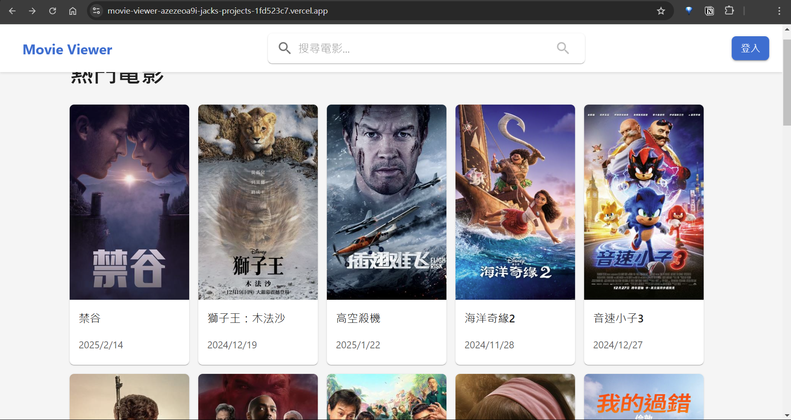

# Movie Viewer

Movie Viewer 是一個現代化的電影評論平台，整合第三方 TMDB API 提供最新電影資訊，使用者可以透過 Google 帳號快速登入，瀏覽電影資訊並進行評分。

網站：
🌐 [https://movie-viewer-p3gmduot3-jacks-projects-1fd523c7.vercel.app/](https://movie-viewer-p3gmduot3-jacks-projects-1fd523c7.vercel.app/)

P.S 因 Railway 額度已用完，網站目前僅有前端可正常運行。
    在開發環境則兩者都能正常運行。

## 功能特點
- 整合 TMDB API 即時電影資訊
- Google 帳號快速登入
- 電影評分系統 (1-10分)
- 電影瀏覽模式
  * 主頁顯示近期熱門電影(按熱門度排序)
  * 搜尋特定電影(搜尋框，支援分頁瀏覽)

## 系統文檔

專案包含詳細的系統設計文檔，幫助開發者更好地理解系統：

### [架構設計文檔](Architecture.md)
- 整體系統架構圖
- 資料庫設計詳解
- 核心功能流程
- 技術選擇說明
- 安全性和效能優化考慮

### [功能設計文檔](Design.md)
- 詳細功能清單
- 完整 API 設計
- API 響應格式規範
- 錯誤處理機制
- 開發進度追蹤

## API 文檔
本專案採用 Swagger UI 作為 API 文檔工具，提供互動式的 API 測試介面：

### 線上文檔網址
- 已部署至 Railway：[https://movie-viewer.up.railway.app/api-docs](https://movie-viewer.up.railway.app/api-docs)

### 使用說明
- API 測試時，請在左上角的 Servers 選單中選擇第二個 "Production" 環境
- 文檔提供完整的 API 端點說明、請求/響應格式範例

## 使用技術 (Tech Stack)

### 後端技術 (Backend)
- Node.js + Express.js
- TypeScript
- dotenv（環境變數管理）
- Helmet（安全性防護）
- Google OAuth 2.0 + JWT（身份驗證）
- Joi（API 請求參數驗證）
- Swagger（API 文檔）
- Morgan（日誌系統）

### 資料庫 (Database)
- PostgreSQL（關聯式資料庫）
  * 用戶資料管理
  * 電影資訊快取
  * 評分資料

### 資料庫工具
- Prisma（ORM for PostgreSQL）

### 前端技術 (Frontend)
- React.js
- TypeScript
- Material UI
- TMDB API 整合
- Google OAuth 2.0 整合

### 開發工具 (Development Tools)
- Nodemon（開發熱重載）
- Mocha（測試框架）
  * Chai（斷言庫）
  * Supertest（HTTP 測試）
  * Sinon（測試替身：mock、stub、spy）
- **K6（後端性能測試）**
- **Cypress（前端 E2E 測試）**
- **GitHub Actions（CI/CD 自動化流程）**

### 部署環境 (Deployment)
- Vercel（前端部署）
- Railway（後端部署）

## 專案結構
```bash
movie-viewer/
├── backend/              # 後端程式碼
│   ├── prisma/           # 資料庫 Schema
│   ├── src/              
│   │   ├── config/       # 配置檔案
│   │   ├── controllers/  # 控制器
│   │   ├── middleware/   # 中間件
│   │   ├── routes/       # 路由定義
│   │   └── services/     # 業務邏輯
│   ├── tests/            # 單元測試檔案
│   │   └── performance/  # K6 性能測試腳本
├── frontend/             # 前端程式碼
│   └── cypress/          # Cypress E2E 測試
└── .github/
    └── workflows/        # GitHub Actions CI/CD 工作流程
```

## 開始使用

### 環境要求
- Node.js >= 16
- PostgreSQL

### 安裝步驟
1. 克隆專案
```bash
git clone https://github.com/poordog777/movie-viewer.git
cd movie-viewer
```

2. 安裝依賴
```bash
# 後端
cd backend
npm install

# 前端
cd frontend
npm install
```

3. 環境設定
- 複製 `.env.example` 到 `.env.development` 和 `.env.production`
- 分別設定開發和生產環境的必要變數：
  - DATABASE_URL
  - JWT_SECRET (用於簽署 Google OAuth 登入後的 JWT Token)
  - GOOGLE_CLIENT_ID (從 Google Cloud Console 獲取)
  - GOOGLE_CLIENT_SECRET (從 Google Cloud Console 獲取)
  - TMDB_API_KEY (從 TMDB 開發者平台獲取)

4. 啟動開發服務器
```bash
# 後端
npm run dev     # 使用開發環境配置
npm run start   # 使用正式環境配置

# 前端
npm start
```

### 環境配置
專案採用兩套環境配置：
- 開發環境（Development）：用於本地開發和測試
  * 使用 .env.development
  * 包含更詳細的日誌輸出
  * 支援測試功能
- 生產環境（Production）：用於實際部署
  * 使用 .env.production
  * 優化的效能設定
  * 最小化日誌輸出

## 測試
```bash
# 前端 Cypress E2E 測試
cd frontend
npm test

# 後端單元測試
cd backend
npm test

# 後端運行特定測試
npm run test:auth    # 認證相關測試

# 後端運行 K6 性能測試
npm run test:perf

# CI/CD 自動化
- 本專案已配置 GitHub Actions，每次 push 或 PR 會自動執行測試與部署流程。
- 工作流程定義於 `.github/workflows/` 目錄下。